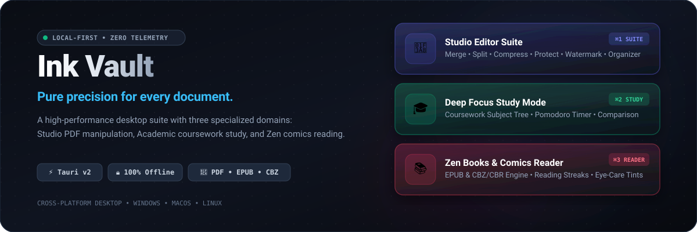

<p align="center">
  
</p>

<p align="center">
  <a href="#-three-workflow-domains"></a>
  <a href="#-tech-stack"></a>
  <a href="#-tech-stack"></a>
  <a href="#-tech-stack"></a>
  <a href="#-tech-stack"></a>
  <a href="#-security--privacy-architecture"></a>
</p>

---

## ⚡ What is Ink Vault?

**Ink Vault** is a high-performance, local-first desktop document suite engineered for speed, privacy, and deep focus. Built with **Tauri v2** and **React**, Ink Vault runs entirely on your local machine with **zero cloud telemetry**—guaranteeing that your research papers, legal contracts, coursework notes, and personal books never leave your storage.

Instead of shoehorning disparate workflows into a single generic PDF viewer, Ink Vault partitions your reading and editing into **three specialized, domain-isolated modes**:

- 🎨 **Studio Editor** (`⌘1` / `Ctrl+1`) — Comprehensive offline PDF utility suite (Merge, Split, Compress, Watermark, Password Protect) with vector annotations and page organization.
- 🎓 **Deep Focus Study Mode** (`⌘2` / `Ctrl+2`) — Academic workspace featuring coursework subject trees, an integrated Pomodoro timer with audio chimes, contextual search, and side-by-side document comparison.
- 📚 **Zen Books & Comics Reader** (`⌘3` / `Ctrl+3`) — Tailored reader for EPUB books and CBZ/CBR graphic novels with dual-page spreads, eye-care tints, reading streaks, and progress tracking.

---

## 🧭 Three Workflow Domains

```
src/modes/
├── studio/                     # 🎨 Mode 1: Studio Editor Domain (PDF Power Tools)
├── study/                      # 🎓 Mode 2: Deep Focus Study Domain (Academics & Research)
└── reader/                     # 📚 Mode 3: Books & Comics Domain (Zen Reader & Stats)
```

### 1. 🎨 Studio Editor Suite
*The complete offline manipulation workshop for high-volume document workflows.*

- **Merge Tool**: Seamlessly stitch multiple PDF files into a single bound document with custom page ordering.
- **Split Tool**: Extract custom page ranges, split by chapters, or isolate specific pages into standalone files.
- **Compress Tool**: Shrink heavy PDF files with selectable compression presets while preserving vector text crispness.
- **Password Protection**: Encrypt sensitive files with user passwords and standard cryptographic permissions.
- **Watermark Engine**: Apply diagonal or horizontal text watermarks with customizable opacity, rotation, and typography.
- **Page Organizer**: Visual drag-and-drop grid to reorder, rotate 90°/180°, duplicate, or delete individual pages before exporting.
- **Vector Annotations**: Freehand drawing tools, rectangle/circle vector shapes, highlighting, and sticky notes with local IndexedDB persistence.

---

### 2. 🎓 Deep Focus Study Mode
*Engineered for university students, researchers, and technical professionals who need continuous comprehension.*

- **Coursework Subject Tree**: Organize academic files into subjects and modules with a recursive, VS Code-inspired file tree explorer.
- **Integrated Pomodoro Focus Timer**: Built-in 25-minute study intervals, 5-minute short breaks, audio chimes, and persistent session statistics.
- **Side-by-Side Comparison (`/compare`)**: Open two documents synchronously with locked side-by-side scrolling to spot revisions and cross-reference citations.
- **Text Reflow Engine**: Convert complex multi-column scientific papers into clean, distraction-free single-column readable text.
- **Sticky Note Annotations**: Attach timestamped notes directly to document coordinates and search them across your study library.

---

### 3. 📚 Zen Books & Comics Reader
*An immersive digital bookshelf tailored for long-form reading, manga, and graphic novels.*

- **Multi-Format Reading**: Native parsing and rendering for **EPUB** digital books, **CBZ**, **CBR**, and **CBN** comic archives via client-side ZIP extraction.
- **Dual-Page Spreads**: Read graphic novels and manga in traditional two-page spreads or continuous vertical scroll.
- **Eye-Care Paper Tints**: Switch between Clean White, Warm Sepia, Soft Amber, Slate Grey, and Obsidian Dark reader themes.
- **Reading Analytics & Streaks**: Automatically tracks daily reading streaks, weekly pages read, estimated time remaining, and star ratings.
- **Sidebar Bookshelf**: Quick-access sidebar displaying format badges (`CBZ`, `EPUB`, `PDF`), visual percentage progress bars, and finished badges.

---

## 🔒 Security & Privacy Architecture

| Feature | Ink Vault | Typical Web PDF Tools |
| :--- | :--- | :--- |
| **Document Processing** | **100% Local Machine** (Tauri + WebAssembly) | Uploaded to third-party cloud servers |
| **Telemetry & Tracking** | **Zero Telemetry** (No analytics, no pingbacks) | User telemetry, analytics, session replays |
| **Network Requirements** | **Works completely offline** | Requires active internet connection |
| **File Storage** | **Local Disk & IndexedDB** | Cloud storage buckets |
| **Memory Footprint** | **Tauri v2 Native WebView** (~40–80 MB idle) | Heavy Electron instances (>300 MB idle) |

---

## ⌨️ Keyboard Shortcuts

| Shortcut | Action |
| :--- | :--- |
| <kbd>⌘O</kbd> / <kbd>Ctrl+O</kbd> | Contextual Open: File Picker (Studio/Reader) or Import Folder (Study) |
| <kbd>⌘1</kbd> / <kbd>Ctrl+1</kbd> | Switch to **Studio Editor** |
| <kbd>⌘2</kbd> / <kbd>Ctrl+2</kbd> | Switch to **Study Mode** |
| <kbd>⌘3</kbd> / <kbd>Ctrl+3</kbd> | Switch to **Books & Comics Reader** |
| <kbd>⌘F</kbd> / <kbd>Ctrl+F</kbd> | Open In-Document Search & Text Highlighter |
| <kbd>Esc</kbd> | Dismiss search overlay, tool drawers, and modals |
| <kbd>Alt+T</kbd> | Toggle Light / Dark Mode |

---

## 🚀 Getting Started

### Prerequisites
- **Node.js**: `>= 22.0.0`
- **npm**: `>= 10.0.0`
- **Rust Toolchain**: Required only if compiling the native Tauri desktop bundle ([Install Rust](https://www.rust-lang.org/tools/install))

### Installation

```bash
# Clone the repository
git clone https://github.com/GopikChenth/InkVault.git
cd InkVault

# Install dependencies
npm install
```

### Running in Development

```bash
# Launch Vite development server
npm run dev

# Or launch the native Tauri v2 desktop application
npm run tauri dev
```

### Building for Production

```bash
# 1. Compile TypeScript & Vite production bundle
npm run build

# 2. Package cross-platform desktop installers (.exe, .dmg, .deb / AppImage)
npm run tauri build
```

---

## 🛠️ Tech Stack

- **Desktop Shell**: [Tauri v2](https://v2.tauri.app/) (Rust)
- **Frontend Framework**: [React 18](https://react.dev/) + [TypeScript 5.7](https://www.typescriptlang.org/)
- **Build System**: [Vite 6](https://vite.dev/)
- **Styling**: [Tailwind CSS 3.4](https://tailwindcss.com/)
- **Icons & Motion**: [Lucide React](https://lucide.dev/), [Anime.js](https://animejs.com/)
- **PDF Engine**: [PDF.js](https://mozilla.github.io/pdf.js/) (`pdfjs-dist`) + [pdf-lib](https://pdf-lib.js.org/)
- **Archive Extraction**: [JSZip](https://stuk.github.io/jszip/)

---

## 📄 License

This project is licensed under the [MIT License](LICENSE).
